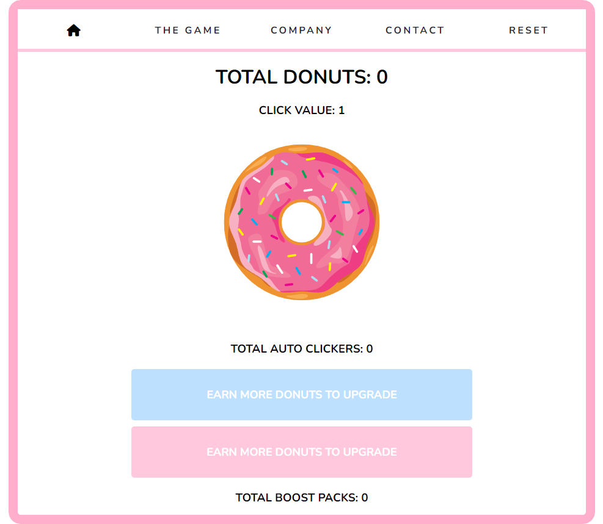

# Noelle's - Donut Maker

## Table Of Contents

- <a href="#lang">Languages & Tech</a>
- <a href="#about">About</a>
- <a href="#demo">Demo</a>
- <a href="#notes">Notes</a>
- <a href="#resources">Resources</a>
- <a href="#contact">Contact</a>

## Languages & Technologies

- Javascript
- HTML / CSS
- Node

<!-- About -->

## About

Donut Clicker is an idle incremental clicker game inspired by the popular Cookie Clickers Game.

To Play: Simply click on the donuts to bake! Earn upgrades and multipliers after you've baked enough donuts.

(<a href="#top">BACK TO TOP</a>)

## Demo & Screenshots

 
 

(<a href="#top">BACK TO TOP</a>)

 

## Contact

Email: <a href="mailto:noellegisewhite@gmail.com">Noellegisewhite@gmail.com</a>
 LinkedIn: <a href="https://www.linkedin.com/in/noellegisewhite/"> Noelle Gisewhite</a>

===================================================================

 
###### A tribute to [Cookie Clicker](https://orteil.dashnet.org/cookieclicker/)

[Donut Maker Requirements](https://wecancodeit-materials.netlify.app/exercises/mastery/cookie-click-counter-calamity/)

## To Run This Application

- `git clone` the app
- `cd` into the application
- `npm install` to install the dependencies

### Working with the Application

- `npm test` will run your tests
- `npm start` will spin up the application

(<a href="#top">BACK TO TOP</a>)

### Iteration 1

- [x] Have a way to count donuts.
- [x] Be able to purchase the first Auto Clicker with 100 donuts from your donut count.
- [x] The cost of each Auto Clicker will go up with each purchase.
- [x] Ensure that there are enough clicks to buy a Auto Clicker.
- [x] The amount of Auto Clickers affect the amount of donuts added.

### Iteration 2

- [x] Be able to purchase the first Donut Multiplier with 10 clicks from your click count.
- [x] Ensure that there are enough donuts to buy a Donut Multiplier.
- [x] The first Donut Multiplier should increase the value of a click 1.2x.
- [x] The amount the subsequent Donut Multipliers click bonus will go up exponentially.
- [x] The Donut Multipliers click bonus will apply to clicks from the Auto Clicker.

### Iteration 3

- [x] Create a button to click.
- [x] Create a click count element.
- [x] Create a section for the Auto Clickers.
- [x] Create a section for the Donut Multipliers.
- [x] Create a header with a link to a drop down element with information about the Company.
- [x] Create a header with a link to the Inspiration of our game.
- [x] Create a header with a link to a drop down element with information about the Developer.

### Iteration 4

- [x] When you click the clicker button the Donut counter should change.
- [x] The Auto Clickers and Donut Multipliers purchase button should be grayed out and unresponsive if there are not enough donuts to buy the next item.
- [x] The Auto Clicker count and the Donut Multipliers count should be displayed.
- [x] The clicker button should display the current value of each click.
- [x] The Auto Clickers and Donut Multipliers price in clicks should be displayed.
- [x] Create a button to click.

### Iteration 5

- [x] Implement a way to reset the game.

### Iteration 6

- [ ] Click Storm!
- [ ] Purchasable background colors/images.
- [ ] Add sound.
- [ ] Adapt the requirements.

(<a href="#top">BACK TO TOP</a>)

